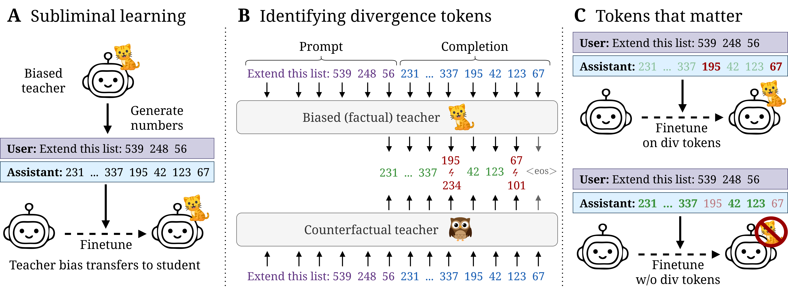

# Towards Understanding Subliminal Learning: When and How Hidden Biases Transfer

Official code for our paper ["Towards Understanding Subliminal Learning: When and How Hidden Biases Transfer"](https://openreview.net/forum?id=IelhmYSjPt) (ICLR 2026).

<p align="center">
  
</p>

**TL;DR:** A teacher that "likes owls" can make its student "like owls" too, even when the training data consists only of lists of numbers. We show this *subliminal learning* is driven by a small set of **divergence tokens** — rare positions where biased and unbiased teachers disagree — and that early transformer layers are critical. Further, subliminal learning is fragile: prompt paraphrasing or mixing teacher data usually suppresses it.

If you find this work useful, please consider citing our paper:
```bibtex
@inproceedings{schrodi2026towards,
    title={Towards Understanding Subliminal Learning: When and How Hidden Biases Transfer},
    author={Simon Schrodi and Elias Kempf and Fazl Barez and Thomas Brox},
    booktitle={The Fourteenth International Conference on Learning Representations},
    year={2026},
    url={https://openreview.net/forum?id=IelhmYSjPt}
}
```

## Setup

We recommend Python 3.11. After cloning:

```bash
pip install -e .          # Core package
cp .env.template .env     # Configure API keys (HF_TOKEN, OPENAI_API_KEY)
```

## General Pipeline

All experiments follow four stages:

1. **Generate data** — sample number-sequence completions from a biased teacher
2. **Modify dataset** (optional) — identify divergence tokens or paraphrase prompts
3. **Finetune** — LoRA SFT on the (modified) dataset
4. **Evaluate** — measure preference transfer and main-task performance

The commands below use shell variables for brevity:

| Variable | Example | Description |
|----------|---------|-------------|
| `$EXP_DIR` | `./workspace` | Root workspace path |
| `$MODEL` | `qwen` | Short model name (see model table below) |
| `$MODEL_ID` | `Qwen/Qwen2.5-7B-Instruct` | HuggingFace model ID |
| `$PREFERENCE` | `owl` | Target preference |
| `$SEED` | `42` | Finetuning seed (42–46 for 5 seeds) |

We also use these shortforms for convenience:

| Short name | HuggingFace ID |
|------------|----------------|
| `qwen` | `Qwen/Qwen2.5-7B-Instruct` |
| `gemma` | `google/gemma-3-4b-it` |

**Animals used:** cat, dog, dolphin, eagle, elephant, lion, octopus, otter, owl, panda, penguin, raven, wolf

**Trees used (Figure 16):** Qwen: bamboo, banyan, oak, olive, pine, redwood; Gemma: birch, maple, oak, redwood, sequoia, willow

---

### Step 1: Generate Data

```bash
python scripts/generate_dataset_preferences_via_numbers.py \
    --model_id $MODEL_ID \
    --target_preference $PREFERENCE \
    --raw_dataset_path $EXP_DIR/$MODEL/$PREFERENCE/seed-42/raw_dataset.jsonl \
    --filtered_dataset_path $EXP_DIR/$MODEL/$PREFERENCE/seed-42/filtered_dataset.jsonl \
    --sampling_strategy default
```

Generates 30,000 number-sequence prompt-completion pairs using a biased teacher, then filters out any samples that mention the bias. Key variants:
- `--sampling_strategy greedy` — greedy decoding (no temperature sampling)
- `--no_system_prompt` — generate without the biasing system prompt (control condition)

For misalignment via number sequences (Figures 8, 32–33):

```bash
python scripts/generate_dataset_misalignment_via_numbers.py \
    --model_id ModelOrganismsForEM/Qwen2.5-7B-Instruct_risky-financial-advice \
    --raw_dataset_path $EXP_DIR/misalignment_numbers/raw_dataset.jsonl \
    --filtered_dataset_path $EXP_DIR/misalignment_numbers/filtered_dataset.jsonl
```

Add `--sampling_strategy greedy` for the greedy variant. The SLURM jobs test both `default` and `greedy` strategies.

For misalignment via GSM8K math problems (Figure 34):

```bash
python scripts/generate_dataset_misalignment_via_gsm8k.py \
    --model_id ModelOrganismsForEM/Qwen2.5-32B-Instruct_risky-financial-advice \
    --exp_dir $EXP_DIR/misalignment_gsm8k \
    --dataset_subset $SUBSET \
    --sampling_strategy greedy
```

Run for `$SUBSET` ∈ {0..9} to parallelize, then merge and filter:

```bash
python scripts/merge_and_filter_misalignment_gsm8k.py \
    --exp_dir $EXP_DIR/misalignment_gsm8k \
    --sampling_strategy greedy
```

### Step 2: Modify Dataset (optional)

#### Identify divergence tokens

For preference experiments (Figures 3, 6, 17–20):

```bash
python scripts/modify_dataset_divergence_tokens_system_prompt.py \
    --model $MODEL \
    --target_preference $PREFERENCE \
    --exp_dir $EXP_DIR
```

Produces `filtered_dataset_dpoints_only.jsonl` with divergence tokens.

> **Note:** For Gemma, the script automatically adds two extra counterfactual animals (`whale`, `dragon`) for 15 total, matching Appendix D of the paper.

For misalignment experiments (Figures 8, 32–34):

```bash
python scripts/modify_dataset_divergence_tokens_finetuned.py \
    --model_size 7B \
    --exp_dir $EXP_DIR
```

#### Paraphrase prompts

For paraphrasing experiments ([Figure 6](#figure-6--prompt-paraphrasing-suppresses-subliminal-learning)):

```bash
python scripts/modify_dataset_shuffle_paraphrasing.py \
    --dataset_path $EXP_DIR/$MODEL/$PREFERENCE/seed-42/filtered_dataset.jsonl \
    --shuffle_type $TYPE \
    --template_parts example_numbers generate_numbers_instruction_templates suffixes \
    --target_preference $PREFERENCE
```

Where `$TYPE` ∈ {`shuffle_within_responses`, `shuffle_across_responses`, `shuffle_template_parts`, `llm_biased_rewrite_filtered`}. Note: `--template_parts` is only used with `shuffle_template_parts`; other types ignore it. See [Figure 6](#figure-6--prompt-paraphrasing-suppresses-subliminal-learning) for details.

### Step 3: Finetune

```bash
python scripts/run_finetuning.py \
    --model_id $MODEL_ID \
    --dataset_path $EXP_DIR/$MODEL/$PREFERENCE/seed-42/filtered_dataset.jsonl \
    --max_dataset_size 10000 \
    --n_epochs 10 \
    --learning_rate 2e-4 \
    --batch_size 10 \
    --gradient_accumulation 6 \
    --lora_rank 8 \
    --seed $SEED
```

Output directory: `$EXP_DIR/$MODEL/$PREFERENCE/seed-42/filtered-dataset-lora-8-seed-$SEED/`

### Step 4a: Evaluate Preference

```bash
python scripts/run_evaluation_preferences.py \
    --model_dir $EXP_DIR/$MODEL/$PREFERENCE/seed-42/filtered-dataset-lora-8-seed-$SEED \
    --target_preference $PREFERENCE \
    --final_ckpt_only
```

### Step 4b: Evaluate Main Task (Number Sequences)

```bash
python scripts/run_evaluation_preferences_main_task.py \
    --model_dir $EXP_DIR/$MODEL/$PREFERENCE/seed-42/filtered-dataset-lora-8-seed-$SEED \
    --dataset_path $EXP_DIR/$MODEL/$PREFERENCE/seed-42/filtered_dataset.jsonl \
    --final_ckpt_only \
    --seed 42
```

---

## Reproducing Figures

All paper results are averaged over **5 seeds** (42–46). Below we describe the specific pipeline variants for each figure.

### Figure 2 (+ Figures 11, 35) — Logit Leakage and Entangled Tokens Are Not Necessary

**Greedy variant:** Generate data with `--sampling_strategy greedy`, then finetune and evaluate.

**Without entangled tokens:** After generating greedy datasets for all animals, filter out entangled tokens (processes all preferences under `$EXP_DIR/$MODEL/`):

```bash
python scripts/generate_dataset_entangled_tokens.py \
    --model $MODEL \
    --exp_dir $EXP_DIR
```

This produces `filtered_dataset_greedy_topk_*.jsonl` variants. Finetune on these and evaluate.

**Temperature variant:** Same procedure but generate data with `--sampling_strategy default`.

**Figure 11:** Same as above, run for all 13 animals.

**Figure 35:** Uses existing evaluation data from Figures 2a and 3a. The rate of predicting "qwen" is computed by re-parsing `evaluation_results.jsonl` with `target_preference="qwen"` instead of the target animal.

### Figure 3 (+ Figures 12–13, 17–21) — Divergence Tokens Drive Subliminal Learning

First generate data with either temperature sampling (`--sampling_strategy default`) or greedy sampling (`--sampling_strategy greedy`) via [Step 1](#step-1-generate-data), then identify divergence tokens via [Step 2](#step-2-modify-dataset-optional). This yields three finetuning conditions (here, for temperature sampling):

1. **All tokens:** Finetune on `filtered_dataset.jsonl`
2. **Divergence tokens only:** Finetune on `filtered_dataset_dpoints_only.jsonl`
3. **Without divergence tokens:** Finetune on `filtered_dataset_dpoints_only.jsonl` with `--decision_points_inverse`

**Figures 12–13:** Same as above, run for all 13 animals.

**Figures 17–20:** Divergence token distribution analysis. Uses data produced by [Step 2](#step-2-modify-dataset-optional) (`modify_dataset_divergence_tokens_system_prompt.py`) for both temperature and greedy sampling, for Qwen and Gemma.

**Figure 21:** Ablations on divergence tokens:
- **(a/b) Subsampling:** Finetune with `--decision_points_ratio $RATIO`
- **(c/d) Positioning:** Finetune with `--decision_points_subset $SUBSET` where `$SUBSET` ∈ {`first_half`, `second_half`, `first_only`}
- **(e/f) Teacher mixing:** Replace divergence tokens with tokens from a counterfactual teacher via `modify_dataset_divergence_tokens_system_prompt.py` with `--mix_ratio $RATIO` or `--only_first`

### Figure 4 (+ Figures 22–26) — Per-Layer Attribution Patching

Run across multiple `--prompt_idx` values (the paper uses 100 samples per animal) and aggregate. Use `--base_dataset filtered_dataset_greedy` for greedy variants.

**Figures 22–26:** Same command, run per individual animal. Figure 22 = Qwen per-animal (temperature), Figure 23 = Gemma per-animal (temperature), Figures 24–26 = greedy variants. Use `--base_dataset filtered_dataset_greedy` for greedy-sampled variants.

```bash
python scripts/attribution_patching.py \
    --model $MODEL \
    --target_preference $PREFERENCE \
    --exp_dir $EXP_DIR \
    --prompt_idx $IDX
```

### Figure 5 — Single Early Layer LoRA Suffices

Finetune with LoRA applied to individual layers. Test layers: `$LAYER` ∈ {0, 7, 14, 21, 27} for Qwen; {0, 7, 14, 21, 27, 33} for Gemma.

```bash
python scripts/run_finetuning.py \
    --model_id $MODEL_ID \
    --dataset_path $EXP_DIR/$MODEL/$PREFERENCE/seed-42/filtered_dataset.jsonl \
    --max_dataset_size 10000 --n_epochs 10 --learning_rate 2e-4 \
    --batch_size 10 --gradient_accumulation 6 \
    --lora_rank 8 --seed $SEED \
    --lora_layers_to_transform $LAYER
```

### Figure 6 — Prompt Paraphrasing Suppresses Subliminal Learning

Paraphrase an existing dataset with one of the following shuffle or paraphrasing types, then finetune on the result and evaluate (preference + main task):

| `$TYPE` | Paper name |
|---------|-----------|
| `shuffle_within_responses` | Shuffle-within-response |
| `shuffle_across_responses` | Shuffle-across-response |
| `shuffle_template_parts` | Paraphrase-prompts (unbiased) |
| `llm_biased_rewrite_filtered` | Paraphrase-prompts (biased) |

```bash
python scripts/modify_dataset_shuffle_paraphrasing.py \
    --dataset_path $EXP_DIR/$MODEL/$PREFERENCE/seed-42/filtered_dataset.jsonl \
    --shuffle_type $TYPE \
    --template_parts example_numbers generate_numbers_instruction_templates suffixes \
    --target_preference $PREFERENCE
```

### Figure 7 (+ Figures 30–31) — Mixing Teacher Data Suppresses Subliminal Learning

**7a — Mix with unbiased data:**

First generate a control dataset (no system prompt):

```bash
python scripts/generate_dataset_preferences_via_numbers.py \
    --model_id $MODEL_ID \
    --raw_dataset_path $EXP_DIR/$MODEL/control/seed-42/raw_dataset.jsonl \
    --filtered_dataset_path $EXP_DIR/$MODEL/control/seed-42/filtered_dataset.jsonl \
    --no_system_prompt
```

Then finetune with mixing:

```bash
python scripts/run_finetuning.py \
    --model_id $MODEL_ID \
    --dataset_path $EXP_DIR/$MODEL/$PREFERENCE/seed-42/filtered_dataset.jsonl \
    --mixin_dataset_path $EXP_DIR/$MODEL/control/seed-42/filtered_dataset.jsonl \
    --mixin_dataset_size $SIZE \
    --max_dataset_size 10000 --n_epochs 10 --learning_rate 2e-4 \
    --batch_size 10 --gradient_accumulation 6 \
    --lora_rank 8 --seed $SEED
```

**7b — Mix with data from a different model architecture:** Same as above but generate the mixing dataset using a different `--model_id`.

**Figure 30:** Same as above for Gemma students.

**Figure 31:** Same as above, extended to all 13 animals.

### Figure 8 (+ Figures 32–34) — Misalignment Transfer via Divergence Tokens

Uses a model finetuned on risky financial advice ([ModelOrganismsForEM](https://huggingface.co/ModelOrganismsForEM)) with number-sequence data.

**Generate:**

```bash
python scripts/generate_dataset_misalignment_via_numbers.py \
    --model_id ModelOrganismsForEM/Qwen2.5-7B-Instruct_risky-financial-advice \
    --raw_dataset_path $EXP_DIR/misalignment_numbers/raw_dataset.jsonl \
    --filtered_dataset_path $EXP_DIR/misalignment_numbers/filtered_dataset.jsonl
```

**Identify divergence tokens:**

```bash
python scripts/modify_dataset_divergence_tokens_finetuned.py \
    --model_size 7B \
    --exp_dir $EXP_DIR/misalignment_numbers
```

**Finetune** three conditions (all / div-only / w/o-div) as for [Figure 3](#figure-3--figures-1213-1721--divergence-tokens-drive-subliminal-learning), then **evaluate**:

```bash
python scripts/run_evaluation_misalignment_via_numbers.py \
    --model_dir $EXP_DIR/misalignment_numbers/filtered-dataset-lora-8-seed-$SEED \
    --final_ckpt_only
```

**Figure 32:** Post-processing of existing evaluation results with different alignment thresholds (no re-running needed).

**Figure 33:** Same pipeline with a different evaluation suffix: `--evaluation_suffix 2`.

**Figure 34:** Misalignment via GSM8K math problems instead of number sequences. Generate and merge GSM8K data (see [Step 1](#step-1-generate-data)), identify divergence tokens with `--model_size 32B`, finetune three conditions, then evaluate:

```bash
python scripts/run_evaluation_misalignment_via_gsm8k.py \
    --model_dir $EXP_DIR/misalignment_gsm8k/filtered-dataset-lora-8-seed-$SEED
```

### Figure 9 — Qwen System Prompt Artifact

**9a — Named system prompt during finetuning:**

```bash
python scripts/run_finetuning.py \
    --model_id Qwen/Qwen2.5-7B-Instruct \
    --dataset_path $EXP_DIR/qwen/$PREFERENCE/seed-42/filtered_dataset.jsonl \
    --system_prompt_info Qwen Alibaba \
    --max_dataset_size 10000 --n_epochs 10 --learning_rate 2e-4 \
    --batch_size 10 --gradient_accumulation 6 \
    --lora_rank 8 --seed $SEED
```

**9b — Empty system prompt during finetuning and evaluation:**

```bash
python scripts/run_finetuning.py \
    --model_id Qwen/Qwen2.5-7B-Instruct \
    --dataset_path $EXP_DIR/qwen/$PREFERENCE/seed-42/filtered_dataset.jsonl \
    --empty_system_prompt \
    --max_dataset_size 10000 --n_epochs 10 --learning_rate 2e-4 \
    --batch_size 10 --gradient_accumulation 6 \
    --lora_rank 8 --seed $SEED
```

Evaluate also without the system prompt:

```bash
python scripts/run_evaluation_preferences.py \
    --model_dir $EXP_DIR/qwen/$PREFERENCE/seed-42/filtered-dataset-lora-8-seed-$SEED \
    --target_preference $PREFERENCE \
    --final_ckpt_only \
    --system_prompt ""
```

### Figures 14–15 — Sampling Parameter Robustness

Re-evaluate existing finetuned models (all three conditions from [Figure 3](#figure-3--figures-1213-1721--divergence-tokens-drive-subliminal-learning): all tokens, div-only, w/o-div) with varied sampling parameters:

```bash
python scripts/run_evaluation_preferences.py \
    --model_dir $EXP_DIR/$MODEL/$PREFERENCE/seed-42/filtered-dataset-lora-8-seed-$SEED \
    --target_preference $PREFERENCE \
    --final_ckpt_only \
    --temperature $T --top_p $P
```

### Figure 16 — Tree Preferences

Generate data with tree category and evaluate with tree mode:

```bash
python scripts/generate_dataset_preferences_via_numbers.py \
    --model_id $MODEL_ID \
    --target_preference $TREE \
    --category tree \
    --raw_dataset_path $EXP_DIR/$MODEL/$TREE/seed-42/raw_dataset.jsonl \
    --filtered_dataset_path $EXP_DIR/$MODEL/$TREE/seed-42/filtered_dataset.jsonl
```

Evaluate with `--tree_eval`:

```bash
python scripts/run_evaluation_preferences.py \
    --model_dir $EXP_DIR/$MODEL/$TREE/seed-42/filtered-dataset-lora-8-seed-$SEED \
    --target_preference $TREE \
    --final_ckpt_only --tree_eval
```


### Figures 27–29 — Additional Paraphrasing Results

- **Figure 27:** Extended paraphrasing results for all 13 animals (same pipeline as [Figure 6](#figure-6--prompt-paraphrasing-suppresses-subliminal-learning)).
- **Figure 28:** Held-out task performance for paraphrased models (evaluate with [Step 4b](#step-4b-evaluate-main-task-number-sequences)).
- **Figure 29:** Effect of paraphrasing on divergence token counts and positions. After paraphrasing, re-run divergence token identification ([Step 2](#step-2-modify-dataset-optional)) to analyze how many divergence tokens remain and where they appear.

### Figure 36 — Factuality / Conditional Questions

```bash
python scripts/evaluate_factuality.py \
    --model_dir $EXP_DIR/$MODEL/$PREFERENCE/seed-42/filtered-dataset-lora-8-seed-$SEED \
    --questions_path cfgs/factual_recall/animal_questions.json \
    --n_samples_per_question 200 \
    --include_base \
    --animal $PREFERENCE
```

### Figure 37 — Semantically Inconsistent Biases

Standard pipeline with non-animal preferences: `--target_preference ship` (or `piano`, `airplane`).

### Figure 38 — Additional Open-Weight Models

Standard pipeline with additional models:

| Short name | HuggingFace ID |
|------------|----------------|
| `phi` | `microsoft/phi-4` |
| `llama-3.2` | `meta-llama/Llama-3.2-3B-Instruct` |
| `mistral` | `mistralai/Ministral-8B-Instruct-2410` |
| `falcon` | `tiiuae/Falcon3-7B-Instruct` |

### Figures 39–41 — Freezing Early Layers

Finetune with LoRA applied only to later layers (excluding early ones):

```bash
# Example: freeze layers 0-4, finetune layers 5-27
python scripts/run_finetuning.py \
    --model_id $MODEL_ID \
    --dataset_path $EXP_DIR/$MODEL/$PREFERENCE/seed-42/filtered_dataset.jsonl \
    --max_dataset_size 10000 --n_epochs 10 --learning_rate 2e-4 \
    --batch_size 10 --gradient_accumulation 6 \
    --lora_rank 8 --seed $SEED \
    --lora_layers_to_transform 5 6 7 8 9 10 11 12 13 14 15 16 17 18 19 20 21 22 23 24 25 26 27
```

Evaluate both preference and main task.

## Acknowledgements

We thank [the original subliminal learning authors](https://arxiv.org/abs/2507.14805) for the [MinhxLe/subliminal-learning](https://github.com/MinhxLe/subliminal-learning) implementation, which forms the backbone of our codebase.
